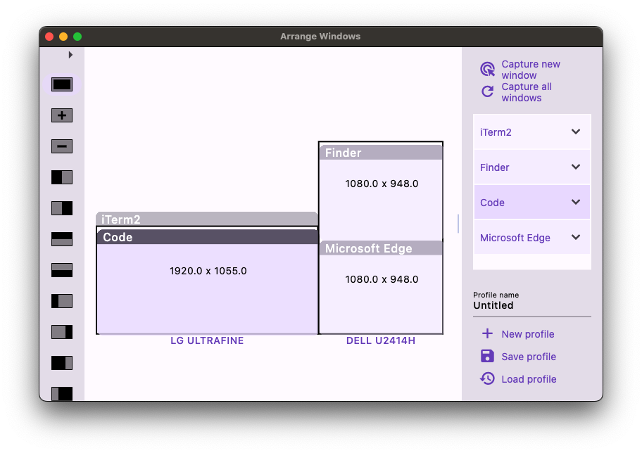
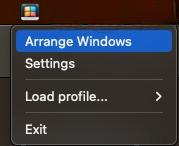

# About this app

Arrange Windows is a macOS app that helps you switch between different windows arrangement for specific tasks. It's designed to save you the trouble of opening and resizing windows again and again.

For example, you can save your daily blog writing windows arrangement, and when you need to write a new blog post, you can quickly switch to that windows arrangement with just a few clicks. Or if you're editing a video, you can save a windows arrangement with the video editor and your notes side-by-side, and quickly switch to that arrangement when needed.

So if you find yourself often switching between different windows arrangement, give Arrange Windows a try and see if it can help you save some time!

# Screenshot

# Reference
This app was built with reference to the Swift source code of 

# Why this app is not released on AppStore
------------------------------------------

Since April 2018, when Apple announced app sandbox, all release macOS app must have app sandbox. However, app sandbox prevents accessibility features. This app relies on accessibility features to retrieve information about windows and to move and resize windows. Without accessibility, the app cannot function properly. Therefore, this app cannot be released on AppStore.
